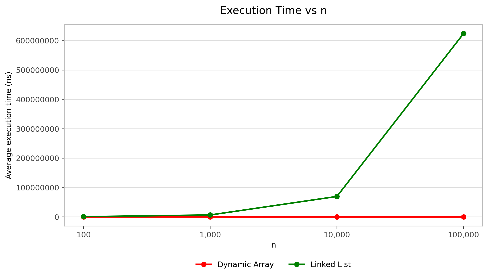
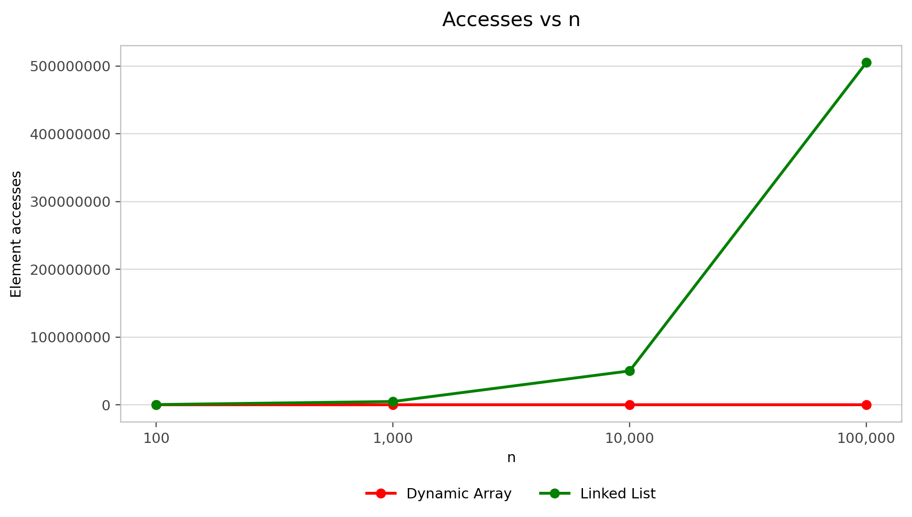

# Assignment 2 — Algorithmic Analysis, Correctness and Performance Trade-offs

## 1. Overview
In this assignment I implemented three data structures in Java:
- Dynamic Array
- Linked List
- Min-Heap

I also created `Benchmark.java` for performance measurements and `Tests.java` for correctness testing.

The main goal was to compare theoretical complexity with measured performance.

## 2. Complexity Analysis

### Dynamic Array

| Operation | Best Case | Average Case | Worst Case | Auxiliary Space |
|---|---|---|---|---|
| `add(x)` | Ω(1) | Θ(1) amortized | O(n) | O(n) if resize happens |
| `add(index, x)` | Ω(1) | Θ(n) | O(n) | O(n) if resize happens |
| `remove(index)` | Ω(1) | Θ(n) | O(n) | O(1) |
| `get(index)` | Ω(1) | Θ(1) | O(1) | O(1) |
| `contains(x)` | Ω(1) | Θ(n) | O(n) | O(1) |

`get(index)` is constant time because the array can directly access an element by index. Insertion and removal can require shifting elements. `add(x)` is usually constant time, but resizing requires copying the existing elements.

### Linked List

| Operation | Best Case | Average Case | Worst Case | Auxiliary Space |
|---|---|---|---|---|
| `add(x)` | Ω(1) | Θ(n) | O(n) | O(1) |
| `add(index, x)` | Ω(1) | Θ(n) | O(n) | O(1) |
| `remove(index)` | Ω(1) | Θ(n) | O(n) | O(1) |
| `get(index)` | Ω(1) | Θ(n) | O(n) | O(1) |
| `contains(x)` | Ω(1) | Θ(n) | O(n) | O(1) |

My Linked List has only a `head`, so `add(x)` needs to traverse the list to reach the end. Insertion and removal at index `0` are constant time because no traversal is needed.

### Min-Heap

| Operation | Best Case | Average Case | Worst Case | Auxiliary Space |
|---|---|---|---|---|
| `insert(x)` | Ω(1) | Θ(log n) | O(log n), O(n) if resize happens | O(n) if resize happens |
| `peekMin()` | Ω(1) | Θ(1) | O(1) | O(1) |
| `extractMin()` | Ω(1) | Θ(log n) | O(log n) | O(1) |

`peekMin()` is constant time because the minimum element is at the root. `insert(x)` can move an element upward, while `extractMin()` can move an element downward through the heap.

## 3. Correctness

### DynamicArray.add(index, x)

**Loop invariant:** Before every iteration of the shifting loop, the elements already processed are in their correct new positions one index to the right.

**Initialization:** At the beginning, `i = size`. No elements have been shifted yet, so the invariant is true.

**Maintenance:** During each iteration:
```java
array[i] = array[i - 1];
```
One element moves one position to the right. Elements that were already shifted stay in their correct positions, so the invariant remains true.

**Termination:** The loop stops when `i == index`. At this point all elements from `index` to the old last element have been shifted one position to the right.

Then:
```java
array[index] = x;
size++;
```

The new element is placed at the required index and the old elements keep their order. Therefore the insertion is correct.

### MinHeap.insert(x)

**Loop invariant:** Before every iteration, the heap property is correct everywhere except possibly between `current` and its parent.

**Initialization:** The new element is inserted at the end of the heap. The old heap was already valid, so only the new element can violate the heap property.

**Maintenance:** The current element is compared with its parent. If:
```java
heap[parent] <= heap[current]
```
the heap property is already correct and the loop stops.

Otherwise the parent and current element are swapped. The possible violation moves one level higher, so the invariant remains true.

**Termination:** The loop stops when the element reaches the root or its parent is smaller than or equal to it.

At termination there is no remaining parent-child violation, so the Min-Heap property is correct.

### Testing
`Tests.java` checked:
- empty structures
- one element
- multiple elements
- duplicate values
- boundary and invalid indices
- large inputs
- Min-Heap insertion and extraction
- non-decreasing `extractMin()` results

The implementations were also compared with Java `ArrayList`, `java.util.LinkedList` and `PriorityQueue`.

Test result:
```text
All tests passed
```

## 4. Experimental Setup
The tested values of `n` were:
```text
100
1,000
10,000
100,000
```

`n` is the number of elements initially stored in the data structure.

Every experiment was repeated **5 times** and the average execution time was reported.

Timing method:
```java
System.nanoTime()
```

Random seed:
```java
Random(42)
```

Input data was generated before the timed section and printing was not included in the measured time.

### Workload 1 — Random Access
- `m = 10,000`
- 10,000 random `get(index)` operations
- Metric: element accesses

### Workload 2 — Search
- `m = 1,000`
- 1,000 `contains(value)` operations
- Metric: element comparisons

### Workload 3 — Insertion and Removal
- `m = 1,000`
- insertion at index `0`
- removal at index `0`
- insertion at `n / 2`
- removal at `n / 2`
- Metrics: Dynamic Array movements and Linked List accesses

For removal, the removed element was restored outside the timed removal section after every operation so that all 1,000 removal measurements could be performed.

### Workload 4 — Priority Processing
- create an empty Min-Heap
- insert `n` random values
- call `extractMin()` `n` times
- Metric: comparisons
- verify that extracted values are in non-decreasing order

## 5. Results
Full result files:
- [workload1.csv](results/tables/workload1.csv)
- [workload2.csv](results/tables/workload2.csv)
- [workload3.csv](results/tables/workload3.csv)
- [workload4.csv](results/tables/workload4.csv)

### Workload 1 — Random Access

| n | Dynamic Array Time (ns) | Array Accesses | Linked List Time (ns) | List Accesses | Theory |
|---:|---:|---:|---:|---:|---|
| 100 | 254,420 | 10,000 | 917,800 | 511,327 | Array Θ(1), List Θ(n) |
| 1,000 | 53,300 | 10,000 | 6,783,300 | 5,021,262 | Array Θ(1), List Θ(n) |
| 10,000 | 7,100 | 10,000 | 69,748,000 | 50,180,278 | Array Θ(1), List Θ(n) |
| 100,000 | 5,920 | 10,000 | 624,060,180 | 505,028,648 | Array Θ(1), List Θ(n) |

Dynamic Array accesses stayed constant. Linked List accesses increased with `n`.

### Workload 2 — Search

| n | Dynamic Array Time (ns) | Array Comparisons | Linked List Time (ns) | List Comparisons | Theory |
|---:|---:|---:|---:|---:|---|
| 100 | 489,260 | 100,000 | 403,480 | 100,000 | Θ(n) |
| 1,000 | 1,112,800 | 1,000,000 | 2,121,740 | 1,000,000 | Θ(n) |
| 10,000 | 2,686,940 | 10,000,000 | 19,102,640 | 10,000,000 | Θ(n) |
| 100,000 | 24,550,160 | 100,000,000 | 171,792,540 | 100,000,000 | Θ(n) |

Both structures made the same number of comparisons, but Dynamic Array was faster for larger inputs.

### Workload 3 — Insert at Beginning

| n | Array Time (ns) | Array Movements | List Time (ns) | List Accesses | Theory |
|---:|---:|---:|---:|---:|---|
| 100 | 1,736,560 | 601,420 | 46,060 | 0 | Array Θ(n), List Θ(1) |
| 1,000 | 78,580 | 1,500,524 | 35,680 | 0 | Array Θ(n), List Θ(1) |
| 10,000 | 254,980 | 10,499,500 | 18,340 | 0 | Array Θ(n), List Θ(1) |
| 100,000 | 4,977,680 | 100,499,500 | 13,760 | 0 | Array Θ(n), List Θ(1) |

### Workload 3 — Remove at Beginning

| n | Array Time (ns) | Array Movements | List Time (ns) | List Accesses | Theory |
|---:|---:|---:|---:|---:|---|
| 100 | 543,160 | 99,000 | 68,900 | 0 | Array Θ(n), List Θ(1) |
| 1,000 | 93,900 | 999,000 | 48,380 | 0 | Array Θ(n), List Θ(1) |
| 10,000 | 393,460 | 9,999,000 | 21,440 | 0 | Array Θ(n), List Θ(1) |
| 100,000 | 5,125,700 | 99,999,000 | 33,080 | 0 | Array Θ(n), List Θ(1) |

### Workload 3 — Insert in Middle

| n | Array Time (ns) | Array Movements | List Time (ns) | List Accesses | Theory |
|---:|---:|---:|---:|---:|---|
| 100 | 1,275,960 | 551,420 | 113,100 | 50,000 | Array Θ(n), List Θ(n) |
| 1,000 | 64,720 | 1,000,524 | 687,180 | 500,000 | Array Θ(n), List Θ(n) |
| 10,000 | 139,280 | 5,499,500 | 6,830,540 | 5,000,000 | Array Θ(n), List Θ(n) |
| 100,000 | 2,552,460 | 50,499,500 | 62,998,960 | 50,000,000 | Array Θ(n), List Θ(n) |

### Workload 3 — Remove in Middle

| n | Array Time (ns) | Array Movements | List Time (ns) | List Accesses | Theory |
|---:|---:|---:|---:|---:|---|
| 100 | 213,100 | 49,000 | 161,960 | 50,000 | Array Θ(n), List Θ(n) |
| 1,000 | 83,920 | 499,000 | 714,420 | 500,000 | Array Θ(n), List Θ(n) |
| 10,000 | 258,860 | 4,999,000 | 6,932,360 | 5,000,000 | Array Θ(n), List Θ(n) |
| 100,000 | 3,385,940 | 49,999,000 | 63,786,440 | 50,000,000 | Array Θ(n), List Θ(n) |

At the beginning, Linked List does not need traversal while Dynamic Array needs to shift elements. In the middle, Dynamic Array shifts elements and Linked List traverses nodes.

### Workload 4 — Priority Processing

| n | Insert Time (ns) | Insert Comparisons | Extract Time (ns) | Extract Comparisons | Non-decreasing | Total Theory |
|---:|---:|---:|---:|---:|:---:|---|
| 100 | 19,420 | 206 | 43,620 | 863 | true | O(n log n) |
| 1,000 | 56,800 | 2,326 | 128,900 | 14,996 | true | O(n log n) |
| 10,000 | 559,220 | 22,753 | 1,255,360 | 216,531 | true | O(n log n) |
| 100,000 | 1,805,800 | 227,857 | 10,118,400 | 2,831,426 | true | O(n log n) |

Per operation:
- `insert(x)`: O(log n), with occasional O(n) resize
- `peekMin()`: Θ(1)
- `extractMin()`: O(log n)

The extracted values were in non-decreasing order for every tested `n`.

### Plots

#### Execution Time vs n


#### Operations / Accesses vs n


## 6. Discussion

1. **How does increasing n affect each workload?**  
Dynamic Array random access stays constant in number of accesses, while Linked List random access becomes more expensive. Search, middle operations and heap processing require more work as `n` increases.

2. **Which results agree with theoretical complexity?**  
The operation counts mostly agree with the theory. Dynamic Array random access stays constant, Linked List random access grows with `n`, and middle insertion/removal grows linearly.

3. **Where do results differ from theoretical prediction?**  
Execution times are not perfectly smooth. Some smaller tests took longer than larger ones even when the operation count was lower.

4. **Why can two algorithms with the same Big-O complexity have different running times?**  
Big-O describes growth, not exact execution time. Two implementations can still perform different amounts of work.

5. **How do constant factors and implementation details affect performance?**  
Dynamic Array accesses array positions directly, while Linked List follows node references. These implementation differences affect measured time.

## 7. Design Recommendations

6. **Why is a Dynamic Array preferable for some workloads?**  
Dynamic Array is useful when fast random access is important because `get(index)` is Θ(1).

7. **When can a Linked List be useful?**  
Linked List is useful when many insertions or removals happen at the beginning because these operations can be Θ(1).

8. **Why is a Heap appropriate for priority-based processing?**  
The minimum element is always stored at the root. `peekMin()` is Θ(1), while insertion and extraction are normally O(log n).

9. **How does the workload influence the choice of data structure?**  
The best structure depends on the operations used most often. Dynamic Array is good for random access, Linked List is useful for beginning insertion/removal, and Min-Heap is suitable for priority processing.

## 8. Conclusion
In this assignment I implemented Dynamic Array, Linked List and Min-Heap and compared their theoretical and experimental performance.

Dynamic Array performed well for random access. Linked List performed well for insertion and removal at the beginning. Min-Heap correctly processed elements by priority.

The experiments mostly followed the theoretical complexity, while measured execution time still varied between runs.
